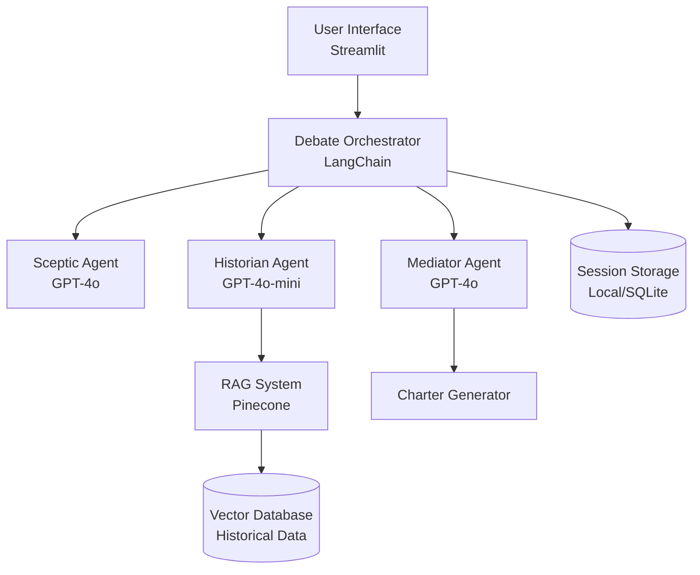

# Design Document: Autonomous Program Charter

## Overview

The Agentic AI Command Center is a multi-agent system that generates realistic, risk-assessed project charters through structured debate between specialized AI agents. The system addresses optimism bias in project planning by orchestrating three distinct agents (Sceptic, Historian, Mediator) that debate project proposals and synthesize balanced, executable plans.

The architecture follows a debate-driven approach where:
1. User submits a project goal
2. Sceptic Agent identifies risks and challenges
3. Historian Agent retrieves relevant historical data via RAG
4. Agents engage in structured debate rounds
5. Mediator Agent synthesizes arguments into a final charter

The system is built with Python/Streamlit for the frontend, OpenAI GPT-4o/GPT-4o-mini for agent intelligence, Pinecone for vector storage, and LangChain for orchestration.

## Architecture

### High-Level Architecture



### Component Layers

1. **Presentation Layer**: Streamlit UI with three-panel layout
2. **Orchestration Layer**: LangChain-based debate coordinator
3. **Agent Layer**: Three specialized LLM agents with distinct personas
4. **Data Layer**: Pinecone vector database for RAG, SQLite for session storage
5. **Integration Layer**: OpenAI API client, retry logic, error handling

### Design Patterns

- **Strategy Pattern**: Each agent implements a common Agent interface with different strategies
- **Observer Pattern**: UI observes debate progress and updates in real-time
- **Chain of Responsibility**: Debate rounds pass through agents sequentially
- **Repository Pattern**: Abstract data access for vector DB and session storage

## Components and Interfaces

### 1. Debate Orchestrator

**Responsibility**: Coordinates multi-agent debate flow, manages debate rounds, enforces time limits.

**Interface**:
```python
class DebateOrchestrator:
    def start_debate(self, project_goal: str) -> DebateSession
    def execute_debate_round(self, session: DebateSession) -> RoundResult
    def should_continue_debate(self, session: DebateSession) -> bool
    def finalize_charter(self, session: DebateSession) -> Charter
```

**Key Methods**:
- `start_debate()`: Initializes debate session, creates agents, starts first round
- `execute_debate_round()`: Runs one debate round (Sceptic → Historian → Mediator)
- `should_continue_debate()`: Determines if consensus reached or max rounds exceeded
- `finalize_charter()`: Triggers Mediator to synthesize final charter

**Configuration**:
- Max debate rounds: 5
- Timeout per round: 60 seconds
- Total session timeout: 5 minutes

### 2. Agent Base Class

**Responsibility**: Common interface for all agents, handles LLM communication, prompt management.

**Interface**:
```python
class Agent(ABC):
    def __init__(self, name: str, model: str, system_prompt: str)
    
    @abstractmethod
    def generate_argument(self, context: DebateContext) -> Argument
    
    def _call_llm(self, prompt: str, temperature: float) -> str
    def _format_context(self, context: DebateContext) -> str
```

**Attributes**:
- `name`: Agent identifier (Sceptic, Historian, Mediator)
- `model`: LLM model name (gpt-4o or gpt-4o-mini)
- `system_prompt`: Agent-specific persona and instructions
- `temperature`: Sampling temperature for LLM calls

### 3. Sceptic Agent

**Responsibility**: Identify risks, flaws, missing dependencies, challenge optimistic assumptions.

**System Prompt Template**:
```
You are the Sceptic Agent in a project planning debate. Your role is to:
1. Identify specific risks and potential failure modes
2. Challenge unrealistic timelines and resource estimates
3. Surface missing dependencies and unstated assumptions
4. Quantify risks with probability and impact when possible
5. Be genuinely critical, not politely cautious

Analyze the project goal and previous arguments. Provide 3-5 specific, actionable concerns.
```

**Configuration**:
- Model: GPT-4o (complex reasoning required)
- Temperature: 0.7 (balanced creativity and consistency)
- Min risks per argument: 3

### 4. Historian Agent

**Responsibility**: Retrieve relevant historical data, cite past project outcomes, ground debate in evidence.

**System Prompt Template**:
```
You are the Historian Agent in a project planning debate. Your role is to:
1. Retrieve relevant historical project data from the knowledge base
2. Cite specific past projects (successes and failures)
3. Identify patterns and lessons learned
4. Provide evidence-based context for the debate
5. Explicitly state when no relevant precedent exists

Use the provided historical data to inform your argument.
```

**Configuration**:
- Model: GPT-4o-mini (simpler retrieval and formatting task)
- Temperature: 0.3 (factual, consistent)
- Min historical examples: 3
- RAG query top-k: 5

**RAG Integration**:
```python
def generate_argument(self, context: DebateContext) -> Argument:
    # Query RAG system
    query_embedding = self._embed_query(context.project_goal)
    historical_docs = self.rag_system.query(query_embedding, top_k=5)
    
    # Format historical context
    historical_context = self._format_historical_docs(historical_docs)
    
    # Generate argument with historical evidence
    prompt = self._build_prompt(context, historical_context)
    response = self._call_llm(prompt, temperature=0.3)
    
    return Argument(agent=self.name, content=response, sources=historical_docs)
```

### 5. Mediator Agent

**Responsibility**: Synthesize arguments, resolve conflicts, generate balanced charter.

**System Prompt Template**:
```
You are the Mediator Agent in a project planning debate. Your role is to:
1. Synthesize arguments from Sceptic and Historian agents
2. Resolve conflicts with reasoned justification
3. Balance opportunities with realistic constraints
4. Generate actionable recommendations
5. Produce structured charter with all required sections

Consider all previous arguments and create a balanced synthesis.
```

**Configuration**:
- Model: GPT-4o (complex synthesis and reasoning)
- Temperature: 0.5 (balanced)
- Charter sections: Executive Summary, Goals, Scope, Risks, Dependencies, Timeline, Resources

**Charter Generation**:
```python
def generate_charter(self, session: DebateSession) -> Charter:
    # Collect all arguments from debate
    all_arguments = session.get_all_arguments()
    
    # Build synthesis prompt
    prompt = self._build_charter_prompt(
        project_goal=session.project_goal,
        arguments=all_arguments
    )
    
    # Generate structured charter
    response = self._call_llm(prompt, temperature=0.5)
    
    # Parse into structured format
    charter = self._parse_charter(response)
    
    # Calculate quality metrics
    charter.quality_score = self._calculate_quality_score(charter)
    
    return charter
```

### 6. RAG System

**Responsibility**: Vector similarity search, document retrieval, embedding generation.

**Interface**:
```python
class RAGSystem:
    def __init__(self, pinecone_api_key: str, index_name: str)
    
    def ingest_documents(self, documents: List[Document]) -> None
    def query(self, query_embedding: List[float], top_k: int) -> List[Document]
    def embed_text(self, text: str) -> List[float]
```

**Document Schema**:
```python
@dataclass
class Document:
    id: str
    content: str
    metadata: Dict[str, Any]  # project_outcome, date, doc_type
    embedding: List[float]
    relevance_score: float = 0.0
```

**Pinecone Configuration**:
- Index dimension: 1536 (OpenAI text-embedding-3-small)
- Metric: cosine similarity
- Metadata filters: doc_type, project_outcome, date_range

**Query Flow**:
```python
def query(self, query_text: str, top_k: int = 5) -> List[Document]:
    # Generate query embedding
    query_embedding = self.embed_text(query_text)
    
    # Query Pinecone
    results = self.index.query(
        vector=query_embedding,
        top_k=top_k,
        include_metadata=True
    )
    
    # Convert to Document objects
    documents = [
        Document(
            id=match.id,
            content=match.metadata['content'],
            metadata=match.metadata,
            embedding=match.values,
            relevance_score=match.score
        )
        for match in results.matches
        if match.score > 0.7  # Relevance threshold
    ]
    
    return documents
```

### 7. Streamlit UI

**Responsibility**: User input, real-time debate visualization, charter display.

**Layout Structure**:
```
┌─────────────────────────────────────────────────────────────┐
│ Header: Autonomous Program Charter                          │
├─────────────────────────────────────────────────────────────┤
│ Input Panel (Full Width)                                    │
│ [Text Area: Project Goal]                                   │
│ [Button: Generate Charter]                                  │
├──────────────────┬──────────────────┬──────────────────────┤
│ Sceptic Panel    │ Historian Panel  │ Mediator Panel       │
│ 🛑 Arguments     │ 📜 Arguments     │ 🤝 Synthesis         │
│ (Real-time)      │ (Real-time)      │ (Real-time)          │
├──────────────────┴──────────────────┴──────────────────────┤
│ Charter Output Panel (Full Width)                           │
│ [Structured Charter Document]                               │
│ [Export Button: PDF/Markdown]                               │
└─────────────────────────────────────────────────────────────┘
```

**Real-Time Updates**:
```python
# Use Streamlit session state and rerun for real-time updates
def display_debate_progress():
    debate_container = st.container()
    
    # Create columns for three agents
    col1, col2, col3 = st.columns(3)
    
    # Poll debate session for new arguments
    while not session.is_complete():
        new_arguments = session.get_new_arguments()
        
        for arg in new_arguments:
            if arg.agent == "Sceptic":
                with col1:
                    st.markdown(f"**Round {arg.round}**")
                    st.write(arg.content)
            elif arg.agent == "Historian":
                with col2:
                    st.markdown(f"**Round {arg.round}**")
                    st.write(arg.content)
            elif arg.agent == "Mediator":
                with col3:
                    st.markdown(f"**Round {arg.round}**")
                    st.write(arg.content)
        
        time.sleep(1)  # Poll interval
        st.rerun()
```

### 8. Session Manager

**Responsibility**: Store debate sessions, enable session history, support session retrieval.

**Interface**:
```python
class SessionManager:
    def create_session(self, project_goal: str) -> DebateSession
    def save_session(self, session: DebateSession) -> None
    def get_session(self, session_id: str) -> DebateSession
    def list_sessions(self, user_id: str, limit: int) -> List[SessionSummary]
```

**Storage Schema (SQLite)**:
```sql
CREATE TABLE sessions (
    session_id TEXT PRIMARY KEY,
    user_id TEXT,
    project_goal TEXT,
    created_at TIMESTAMP,
    completed_at TIMESTAMP,
    status TEXT,  -- 'in_progress', 'completed', 'failed'
    quality_score REAL
);

CREATE TABLE arguments (
    argument_id TEXT PRIMARY KEY,
    session_id TEXT,
    agent_name TEXT,
    round_number INTEGER,
    content TEXT,
    timestamp TIMESTAMP,
    FOREIGN KEY (session_id) REFERENCES sessions(session_id)
);

CREATE TABLE charters (
    charter_id TEXT PRIMARY KEY,
    session_id TEXT,
    content TEXT,
    quality_score REAL,
    created_at TIMESTAMP,
    FOREIGN KEY (session_id) REFERENCES sessions(session_id)
);
```

## Data Models

### DebateSession

```python
@dataclass
class DebateSession:
    session_id: str
    project_goal: str
    created_at: datetime
    status: SessionStatus  # INITIALIZING, IN_PROGRESS, COMPLETED, FAILED
    current_round: int
    max_rounds: int
    arguments: List[Argument]
    charter: Optional[Charter]
    quality_metrics: QualityMetrics
    
    def add_argument(self, argument: Argument) -> None
    def get_arguments_by_agent(self, agent_name: str) -> List[Argument]
    def get_arguments_by_round(self, round_num: int) -> List[Argument]
    def is_complete(self) -> bool
```

### Argument

```python
@dataclass
class Argument:
    argument_id: str
    agent_name: str  # "Sceptic", "Historian", "Mediator"
    round_number: int
    content: str
    timestamp: datetime
    sources: List[Document]  # For Historian arguments
    metadata: Dict[str, Any]
```

### Charter

```python
@dataclass
class Charter:
    charter_id: str
    session_id: str
    executive_summary: str
    goals: List[str]
    scope: ScopeDefinition
    risks: List[Risk]
    dependencies: List[Dependency]
    timeline: Timeline
    resources: ResourceRequirements
    quality_score: float
    created_at: datetime
    
    def to_markdown(self) -> str
    def to_pdf(self) -> bytes
```

### Risk

```python
@dataclass
class Risk:
    risk_id: str
    description: str
    probability: float  # 0.0 to 1.0
    impact: ImpactLevel  # LOW, MEDIUM, HIGH, CRITICAL
    mitigation: str
    owner: Optional[str]
```

### ScopeDefinition

```python
@dataclass
class ScopeDefinition:
    in_scope: List[str]
    out_of_scope: List[str]
    assumptions: List[str]
    constraints: List[str]
```

### Timeline

```python
@dataclass
class Timeline:
    start_date: Optional[date]
    end_date: Optional[date]
    duration_estimate: str  # e.g., "8-12 weeks"
    milestones: List[Milestone]
    
@dataclass
class Milestone:
    name: str
    description: str
    target_date: Optional[date]
    dependencies: List[str]
```

### QualityMetrics

```python
@dataclass
class QualityMetrics:
    completeness_score: float  # 0.0 to 1.0
    risk_coverage_score: float  # Number of risks identified
    specificity_score: float  # Measure of concrete vs vague language
    revision_degree: float  # How much changed from original goal
    
    def calculate_overall_score(self) -> float:
        return (
            self.completeness_score * 0.3 +
            min(self.risk_coverage_score / 10, 1.0) * 0.3 +
            self.specificity_score * 0.2 +
            self.revision_degree * 0.2
        )
```

## Correctness Properties

*A property is a characteristic or behavior that should hold true across all valid executions of a system—essentially, a formal statement about what the system should do. Properties serve as the bridge between human-readable specifications and machine-verifiable correctness guarantees.*

